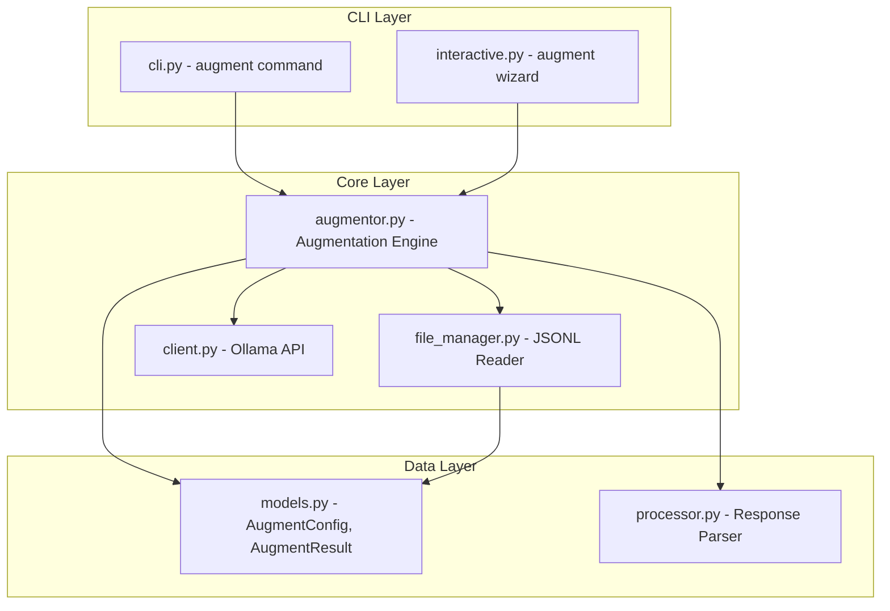
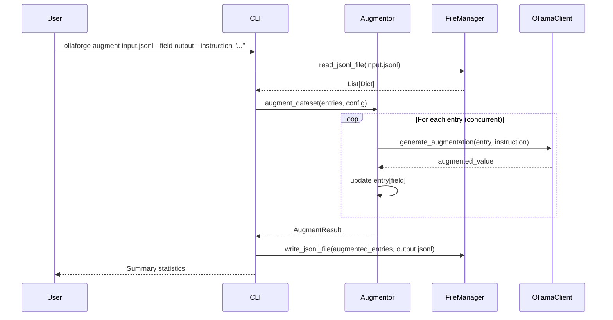
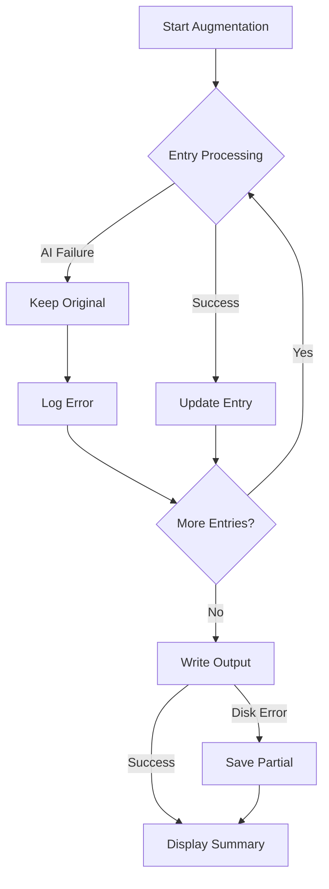

# Design Document: Dataset Augmentation

## Overview

本設計為 OllaForge 新增資料集擴展（Dataset Augmentation）功能，讓使用者能夠載入現有 JSONL 資料集，指定目標欄位，並透過 AI 模型對該欄位進行擴展、增強或轉換。

此功能將整合到現有的 CLI 架構中，作為新的 `augment` 子命令，並複用現有的 Ollama 客戶端、檔案管理和進度追蹤模組。

## Architecture



### Data Flow



## Components and Interfaces

### 1. AugmentationConfig (models.py)

新增資料模型用於擴展配置：

```python
class AugmentationConfig(BaseModel):
    """Configuration for dataset augmentation."""
    input_file: str = Field(..., description="Path to source JSONL file")
    output_file: str = Field(..., description="Path to output JSONL file")
    target_field: str = Field(..., description="Field name to augment or create")
    instruction: str = Field(..., description="AI instruction for augmentation")
    model: str = Field("llama3.2", description="Ollama model to use")
    language: OutputLanguage = Field(OutputLanguage.EN, description="Output language")
    create_new_field: bool = Field(False, description="Whether to create a new field")
    context_fields: List[str] = Field(default_factory=list, description="Additional fields to include as context")
    preview_count: int = Field(3, ge=1, le=10, description="Number of entries for preview")
```

### 2. AugmentationResult (models.py)

```python
class AugmentationResult(BaseModel):
    """Result of dataset augmentation operation."""
    total_entries: int = Field(..., description="Total entries in source dataset")
    success_count: int = Field(..., description="Successfully augmented entries")
    failure_count: int = Field(..., description="Failed augmentation attempts")
    output_file: str = Field(..., description="Path to output file")
    duration: float = Field(..., description="Total processing time in seconds")
    errors: List[str] = Field(default_factory=list, description="Error messages")
```

### 3. Augmentor Module (augmentor.py)

核心擴展引擎，負責協調整個擴展流程：

```python
class DatasetAugmentor:
    """Core engine for dataset augmentation."""
    
    def __init__(self, config: AugmentationConfig):
        self.config = config
        self.console = Console()
    
    def load_dataset(self) -> Tuple[List[Dict], List[str]]:
        """Load dataset and extract available fields."""
        pass
    
    def validate_field(self, entries: List[Dict], field: str) -> bool:
        """Validate that target field exists or can be created."""
        pass
    
    def augment_entry(self, entry: Dict) -> Tuple[Dict, Optional[str]]:
        """Augment a single entry, returns (augmented_entry, error_or_none)."""
        pass
    
    def augment_dataset(self, entries: List[Dict], concurrency: int = 5) -> AugmentationResult:
        """Augment entire dataset with concurrent processing."""
        pass
    
    def preview(self, entries: List[Dict]) -> List[Tuple[Dict, Dict]]:
        """Generate preview of augmentation on sample entries."""
        pass
```

### 4. CLI Integration (cli.py)

新增 `augment` 子命令：

```python
@app.command()
def augment(
    input_file: str = typer.Argument(..., help="Source JSONL file"),
    field: str = typer.Option(..., "--field", "-f", help="Target field to augment"),
    instruction: str = typer.Option(..., "--instruction", "-I", help="AI instruction"),
    output: str = typer.Option(None, "--output", "-o", help="Output file (default: input_augmented.jsonl)"),
    model: str = typer.Option("llama3.2", "--model", "-m", help="Ollama model"),
    concurrency: int = typer.Option(5, "--concurrency", "-j", help="Parallel requests"),
    new_field: bool = typer.Option(False, "--new-field", help="Create new field instead of modifying"),
    context: List[str] = typer.Option(None, "--context", "-c", help="Additional context fields"),
    preview: bool = typer.Option(False, "--preview", "-p", help="Preview before full processing"),
    interactive: bool = typer.Option(False, "--interactive", "-i", help="Interactive mode"),
    force: bool = typer.Option(False, "--force", "-y", help="Overwrite without confirmation"),
) -> None:
    """Augment an existing dataset by modifying or adding fields using AI."""
    pass
```

### 5. Prompt Engineering for Augmentation

擴展專用的 prompt 模板：

```python
def create_augmentation_prompt(
    entry: Dict,
    target_field: str,
    instruction: str,
    context_fields: List[str],
    language: OutputLanguage
) -> Tuple[str, str]:
    """Create system and user prompts for augmentation."""
    
    # Build context from specified fields
    context_parts = []
    for field in context_fields:
        if field in entry:
            context_parts.append(f"{field}: {entry[field]}")
    
    context_str = "\n".join(context_parts) if context_parts else "No additional context"
    
    system_prompt = f"""You are a data augmentation assistant. Your task is to generate or modify the "{target_field}" field based on the given instruction and context.

Instruction: {instruction}

Output ONLY the value for the "{target_field}" field. No JSON wrapping, no explanation, just the raw value."""

    user_prompt = f"""Context:
{context_str}

Current value of "{target_field}": {entry.get(target_field, "(empty - create new)")}

Generate the augmented value for "{target_field}":"""

    return system_prompt, user_prompt
```

## Data Models

### Input/Output Formats

輸入和輸出都使用 JSONL 格式，每行一個 JSON 物件：

```jsonl
{"instruction": "翻譯成英文", "input": "你好", "output": "Hello"}
{"instruction": "翻譯成英文", "input": "謝謝", "output": "Thank you"}
```

擴展後（例如新增 `difficulty` 欄位）：

```jsonl
{"instruction": "翻譯成英文", "input": "你好", "output": "Hello", "difficulty": "easy"}
{"instruction": "翻譯成英文", "input": "謝謝", "output": "Thank you", "difficulty": "easy"}
```

### JSON Schema for Augmentation Response

```python
AUGMENTATION_SCHEMA = {
    "type": "object",
    "properties": {
        "value": {"type": "string"}
    },
    "required": ["value"]
}
```

## Error Handling

| Error Type | Handling Strategy |
|------------|-------------------|
| File not found | Display clear error with file path |
| Invalid JSONL | Report line number and parsing error |
| Field not found | List available fields, suggest alternatives |
| Ollama connection failure | Retry with backoff, save partial results |
| AI generation failure | Keep original entry, log error, continue |
| Disk space insufficient | Check before writing, abort with message |
| User interruption | Save processed entries to partial file |

### Error Recovery Flow



## Testing Strategy

### Property-Based Testing Framework

使用 Hypothesis 進行 property-based testing，這是 Python 生態系中最成熟的 PBT 框架。

### Unit Tests

- 測試 JSONL 讀取與解析
- 測試欄位驗證邏輯
- 測試 prompt 生成
- 測試錯誤處理路徑

### Property-Based Tests

每個 property test 將執行至少 100 次迭代，使用 Hypothesis 的 `@settings(max_examples=100)` 配置。

測試檔案將標註對應的 correctness property：
```python
# **Feature: dataset-augmentation, Property 1: Round-trip JSON consistency**
@given(st.dictionaries(st.text(), st.text()))
def test_json_round_trip(entry):
    ...
```

### Integration Tests

- 端對端測試完整的擴展流程
- 測試 CLI 參數解析
- 測試並行處理

## Correctness Properties

*A property is a characteristic or behavior that should hold true across all valid executions of a system-essentially, a formal statement about what the system should do. Properties serve as the bridge between human-readable specifications and machine-verifiable correctness guarantees.*

Based on the acceptance criteria analysis, the following correctness properties have been identified:

### Property 1: JSON Round-Trip Consistency

*For any* valid dictionary entry, serializing it to JSON and deserializing it back SHALL produce an equivalent dictionary.

This property validates the core data integrity of the augmentation pipeline - entries must survive the serialization/deserialization cycle without data loss or corruption.

**Validates: Requirements 1.1, 3.4, 4.1**

### Property 2: Invalid JSONL Error Reporting

*For any* JSONL file containing at least one malformed JSON line, the parser SHALL report an error that includes the line number of the first malformed line.

**Validates: Requirements 1.3**

### Property 3: Field Validation - Existing Field Accepted

*For any* dataset containing entries with a set of fields F, and *for any* field name f ∈ F, the field validation SHALL accept f as a valid target field.

**Validates: Requirements 2.1**

### Property 4: Field Validation - Non-Existing Field Rejected

*For any* dataset containing entries with a set of fields F, and *for any* field name f ∉ F (where create_new_field is False), the field validation SHALL reject f and the error message SHALL contain at least one field from F.

**Validates: Requirements 2.2**

### Property 5: Prompt Contains Context and Instruction

*For any* entry with context fields and *for any* non-empty instruction string, the generated prompt SHALL contain both the instruction text and the values of all specified context fields.

**Validates: Requirements 2.3, 3.1**

### Property 6: New Field Creation

*For any* entry and *for any* valid new field name (not already in entry), when create_new_field is True, the augmented entry SHALL contain the new field.

**Validates: Requirements 2.4**

### Property 7: Successful Response Updates Target Field

*For any* entry and *for any* valid AI response, the augmented entry's target field SHALL contain the value from the AI response.

**Validates: Requirements 3.2**

### Property 8: Failure Preserves Original Entry

*For any* entry, when AI generation fails, the returned entry SHALL be equal to the original entry (no modifications).

**Validates: Requirements 3.3**

### Property 9: Concurrent Processing Correctness

*For any* list of N entries processed with concurrency level C, the result SHALL contain exactly N entries, and each result entry SHALL correspond to exactly one input entry.

**Validates: Requirements 3.5**

### Property 10: Statistics Accuracy

*For any* augmentation run with S successes and F failures out of T total entries, the result statistics SHALL report success_count = S, failure_count = F, and total_entries = T, where S + F = T.

**Validates: Requirements 1.4, 5.2, 5.3**

### Property 11: Preview Count Correctness

*For any* dataset with N entries and preview_count P, the preview SHALL process exactly min(N, P) entries.

**Validates: Requirements 7.1**
