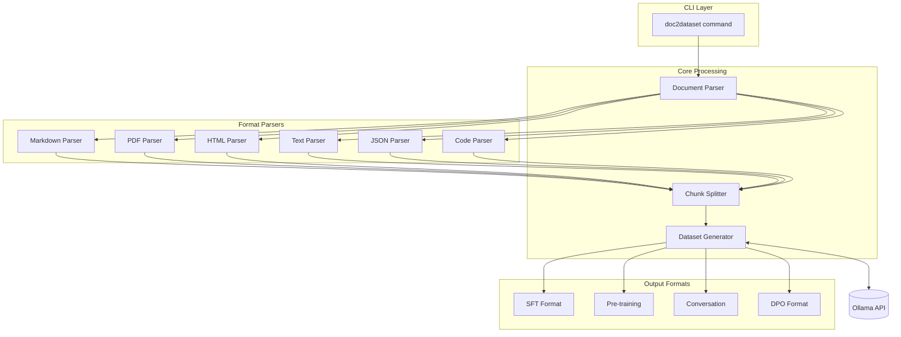

# Design Document: Document to Dataset

## Overview

本設計文件描述如何擴展 OllaForge CLI，新增從各種文件格式自動生成 fine-tuning 資料集的功能。系統採用模組化架構，包含文件解析器、分塊處理器和資料集生成器三個核心元件，透過 Ollama LLM 將文件內容轉換為 SFT、Pre-training、Conversation 或 DPO 格式的訓練資料。

## Architecture



## Components and Interfaces

### 1. Document Parser (`ollaforge/doc_parser.py`)

負責解析各種文件格式並提取純文字內容。

```python
from abc import ABC, abstractmethod
from dataclasses import dataclass
from enum import Enum
from typing import List, Optional, Tuple
from pathlib import Path


class DocumentType(Enum):
    """支援的文件類型"""
    MARKDOWN = "markdown"
    PDF = "pdf"
    HTML = "html"
    TEXT = "text"
    JSON = "json"
    CODE = "code"


@dataclass
class ParsedDocument:
    """解析後的文件結構"""
    content: str                    # 提取的純文字內容
    doc_type: DocumentType          # 文件類型
    metadata: dict                  # 元資料 (標題、作者等)
    sections: List['DocumentSection']  # 文件區段 (用於分塊)
    source_path: str                # 原始檔案路徑


@dataclass
class DocumentSection:
    """文件區段"""
    title: Optional[str]            # 區段標題
    content: str                    # 區段內容
    level: int                      # 層級 (用於 Markdown 標題)
    start_line: int                 # 起始行號
    end_line: int                   # 結束行號


class BaseParser(ABC):
    """文件解析器基底類別"""
    
    @abstractmethod
    def parse(self, file_path: str) -> ParsedDocument:
        """解析文件並返回結構化內容"""
        pass
    
    @abstractmethod
    def supports(self, file_path: str) -> bool:
        """檢查是否支援該檔案格式"""
        pass


class DocumentParserFactory:
    """文件解析器工廠"""
    
    _parsers: dict[str, BaseParser] = {}
    
    @classmethod
    def register(cls, extensions: List[str], parser: BaseParser) -> None:
        """註冊解析器"""
        for ext in extensions:
            cls._parsers[ext.lower()] = parser
    
    @classmethod
    def get_parser(cls, file_path: str) -> BaseParser:
        """根據副檔名取得對應解析器"""
        ext = Path(file_path).suffix.lower()
        if ext not in cls._parsers:
            raise UnsupportedFormatError(
                f"Unsupported format: {ext}",
                supported_formats=list(cls._parsers.keys())
            )
        return cls._parsers[ext]
    
    @classmethod
    def get_supported_formats(cls) -> List[str]:
        """取得所有支援的格式"""
        return list(cls._parsers.keys())


class UnsupportedFormatError(Exception):
    """不支援的檔案格式錯誤"""
    def __init__(self, message: str, supported_formats: List[str]):
        self.message = message
        self.supported_formats = supported_formats
        super().__init__(message)
```

### 2. Chunk Splitter (`ollaforge/chunk_splitter.py`)

負責將長文件分割成適合 LLM 處理的區塊。

```python
from dataclasses import dataclass
from typing import List, Optional
from enum import Enum


class SplitStrategy(Enum):
    """分割策略"""
    FIXED_SIZE = "fixed_size"       # 固定大小分割
    SEMANTIC = "semantic"           # 語意邊界分割
    HYBRID = "hybrid"               # 混合策略


@dataclass
class ChunkConfig:
    """分塊配置"""
    chunk_size: int = 2000          # 區塊大小 (字元數)
    chunk_overlap: int = 200        # 區塊重疊 (字元數)
    strategy: SplitStrategy = SplitStrategy.HYBRID
    respect_code_blocks: bool = True    # 保留程式碼區塊完整性
    respect_paragraphs: bool = True     # 保留段落完整性


@dataclass
class TextChunk:
    """文字區塊"""
    content: str                    # 區塊內容
    index: int                      # 區塊索引
    start_char: int                 # 起始字元位置
    end_char: int                   # 結束字元位置
    metadata: dict                  # 區塊元資料 (來源區段等)


class ChunkSplitter:
    """文件分塊處理器"""
    
    def __init__(self, config: ChunkConfig = None):
        self.config = config or ChunkConfig()
    
    def split(self, document: 'ParsedDocument') -> List[TextChunk]:
        """將文件分割成區塊"""
        pass
    
    def _split_by_semantic_boundaries(self, text: str) -> List[str]:
        """根據語意邊界分割"""
        pass
    
    def _split_markdown(self, document: 'ParsedDocument') -> List[TextChunk]:
        """Markdown 專用分割 (保留標題層級)"""
        pass
    
    def _split_code(self, document: 'ParsedDocument') -> List[TextChunk]:
        """程式碼專用分割 (保留函數/類別邊界)"""
        pass
    
    def _merge_small_chunks(self, chunks: List[TextChunk]) -> List[TextChunk]:
        """合併過小的區塊"""
        pass
```

### 3. Dataset Generator (`ollaforge/doc_generator.py`)

負責根據文件內容生成訓練資料。

```python
from dataclasses import dataclass
from typing import List, Optional, Callable
from enum import Enum

from .models import DatasetType, OutputLanguage, DatasetEntry
from .chunk_splitter import TextChunk


@dataclass
class DocGenerationConfig:
    """文件轉資料集配置"""
    dataset_type: DatasetType = DatasetType.SFT
    model: str = "llama3.2"
    language: OutputLanguage = OutputLanguage.EN
    entries_per_chunk: int = 3      # 每個區塊生成的資料筆數
    qc_enabled: bool = True         # 啟用品質控制
    qc_confidence: float = 0.9      # QC 信心閾值


class DocumentDatasetGenerator:
    """文件資料集生成器"""
    
    def __init__(self, config: DocGenerationConfig):
        self.config = config
    
    def generate_from_chunks(
        self,
        chunks: List[TextChunk],
        progress_callback: Optional[Callable[[int, int], None]] = None
    ) -> List[DatasetEntry]:
        """從區塊生成資料集"""
        pass
    
    def _create_prompt_for_chunk(
        self,
        chunk: TextChunk,
        dataset_type: DatasetType
    ) -> str:
        """為區塊建立生成提示"""
        pass
    
    def _validate_entry(self, entry: dict, dataset_type: DatasetType) -> bool:
        """驗證生成的資料項目"""
        pass
```

### 4. CLI Integration (`ollaforge/cli.py` extension)

新增 `doc2dataset` 子命令。

```python
@app.command()
def doc2dataset(
    source: str = typer.Argument(
        ...,
        help="Source document or directory path",
    ),
    output: str = typer.Option(
        "dataset.jsonl",
        "--output", "-o",
        help="Output dataset file path",
    ),
    dataset_type: str = typer.Option(
        "sft",
        "--type", "-t",
        help="Dataset type: sft, pretrain, sft_conv, dpo",
    ),
    model: str = typer.Option(
        "llama3.2",
        "--model", "-m",
        help="Ollama model to use",
    ),
    chunk_size: int = typer.Option(
        2000,
        "--chunk-size",
        help="Chunk size in characters (500-10000)",
    ),
    chunk_overlap: int = typer.Option(
        200,
        "--chunk-overlap",
        help="Overlap between chunks (0-1000)",
    ),
    count: int = typer.Option(
        3,
        "--count", "-c",
        help="Entries to generate per chunk (1-10)",
    ),
    language: str = typer.Option(
        "en",
        "--lang", "-l",
        help="Output language: en, zh-tw",
    ),
    pattern: Optional[str] = typer.Option(
        None,
        "--pattern", "-p",
        help="File pattern for directory processing (e.g., '*.md')",
    ),
    recursive: bool = typer.Option(
        True,
        "--recursive/--no-recursive",
        help="Recursively process directories",
    ),
    qc_enabled: bool = typer.Option(
        True,
        "--qc/--no-qc",
        help="Enable quality control",
    ),
) -> None:
    """
    Convert documents to fine-tuning datasets.
    
    Examples:
        # Convert a single Markdown file
        ollaforge doc2dataset README.md --type sft
        
        # Convert all Python files in a directory
        ollaforge doc2dataset ./src --pattern "*.py" --type pretrain
        
        # Generate conversation data from documentation
        ollaforge doc2dataset docs/ --type sft_conv --lang zh-tw
    """
    pass
```

## Data Models

### 新增資料模型 (`ollaforge/models.py` extension)

```python
from pydantic import BaseModel, Field, validator
from typing import List, Optional
from pathlib import Path


class DocToDatasetConfig(BaseModel):
    """文件轉資料集完整配置"""
    source_path: str = Field(..., description="來源文件或目錄路徑")
    output_file: str = Field("dataset.jsonl", description="輸出檔案路徑")
    dataset_type: DatasetType = Field(DatasetType.SFT, description="資料集類型")
    model: str = Field("llama3.2", description="Ollama 模型")
    language: OutputLanguage = Field(OutputLanguage.EN, description="輸出語言")
    chunk_size: int = Field(2000, ge=500, le=10000, description="區塊大小")
    chunk_overlap: int = Field(200, ge=0, le=1000, description="區塊重疊")
    entries_per_chunk: int = Field(3, ge=1, le=10, description="每區塊生成筆數")
    file_pattern: Optional[str] = Field(None, description="檔案過濾模式")
    recursive: bool = Field(True, description="遞迴處理目錄")
    qc_enabled: bool = Field(True, description="啟用品質控制")
    qc_confidence: float = Field(0.9, ge=0.0, le=1.0, description="QC 信心閾值")
    
    @validator('source_path')
    def source_must_exist(cls, v):
        path = Path(v)
        if not path.exists():
            raise ValueError(f'Source path does not exist: {v}')
        return v
    
    @validator('chunk_overlap')
    def overlap_must_be_less_than_size(cls, v, values):
        if 'chunk_size' in values and v >= values['chunk_size']:
            raise ValueError('Chunk overlap must be less than chunk size')
        return v


class DocProcessingResult(BaseModel):
    """文件處理結果"""
    source_file: str = Field(..., description="來源檔案")
    chunks_processed: int = Field(..., ge=0, description="處理的區塊數")
    entries_generated: int = Field(..., ge=0, description="生成的資料筆數")
    errors: List[str] = Field(default_factory=list, description="錯誤訊息")


class BatchProcessingResult(BaseModel):
    """批次處理結果"""
    total_files: int = Field(..., ge=0, description="總檔案數")
    successful_files: int = Field(..., ge=0, description="成功處理的檔案數")
    failed_files: int = Field(..., ge=0, description="失敗的檔案數")
    total_entries: int = Field(..., ge=0, description="總生成資料筆數")
    output_file: str = Field(..., description="輸出檔案路徑")
    duration: float = Field(..., ge=0, description="處理時間 (秒)")
    file_results: List[DocProcessingResult] = Field(
        default_factory=list, description="各檔案處理結果"
    )
    errors: List[str] = Field(default_factory=list, description="全域錯誤")
```

## Correctness Properties

*A property is a characteristic or behavior that should hold true across all valid executions of a system-essentially, a formal statement about what the system should do. Properties serve as the bridge between human-readable specifications and machine-verifiable correctness guarantees.*


### Property 1: Parser Content Extraction

*For any* supported file format (Markdown, HTML, TXT, JSON, code files), parsing the file SHALL extract the text content correctly, and the extracted content SHALL contain all textual information from the source.

**Validates: Requirements 1.1, 1.3, 1.4, 1.5, 1.6**

### Property 2: Unsupported Format Error Handling

*For any* file with an unsupported extension, the Document_Parser SHALL raise an UnsupportedFormatError that includes the list of supported formats.

**Validates: Requirements 1.7**

### Property 3: Chunk Size Compliance

*For any* chunk size configuration and any document content, all generated chunks SHALL have length less than or equal to the configured chunk size.

**Validates: Requirements 2.1, 2.5**

### Property 4: Semantic Boundary Preservation

*For any* document with clear semantic boundaries (paragraphs, headings, code blocks), the Chunk_Splitter SHALL not split content mid-paragraph or mid-heading when the boundary fits within chunk size.

**Validates: Requirements 2.2, 2.3, 2.4**

### Property 5: Chunk Overlap Correctness

*For any* configured overlap value and consecutive chunk pairs, the end of chunk N and the beginning of chunk N+1 SHALL share exactly the configured overlap characters (when content permits).

**Validates: Requirements 2.6**

### Property 6: Dataset Entry Schema Validation

*For any* generated dataset entry, the entry SHALL conform to its format schema:
- SFT: non-empty instruction, input, output fields
- Pre-training: non-empty text field
- Conversation: conversations array with role/content objects
- DPO: non-empty prompt, chosen, rejected fields

**Validates: Requirements 3.1, 3.2, 3.3, 3.4, 7.1, 7.2**

### Property 7: Conversation Role Requirements

*For any* generated Conversation entry, the conversations array SHALL contain at least one message with role "user" and at least one message with role "assistant".

**Validates: Requirements 7.3**

### Property 8: DPO Response Differentiation

*For any* generated DPO entry, the chosen response SHALL be different from the rejected response (chosen != rejected).

**Validates: Requirements 7.4**

### Property 9: Serialization Round-Trip

*For any* valid dataset entry, serializing to JSON and deserializing back SHALL produce an equivalent entry.

**Validates: Requirements 3.6**

### Property 10: Pattern Filtering Correctness

*For any* glob pattern and directory of files, the filtered file list SHALL contain exactly the files matching the pattern and no files that don't match.

**Validates: Requirements 6.3**

### Property 11: Multi-File Result Aggregation

*For any* set of successfully processed files, the output dataset SHALL contain entries from all processed files, and the total entry count SHALL equal the sum of entries from each file.

**Validates: Requirements 6.5**

## Error Handling

### Parser Errors

| Error Type | Condition | User Message |
|------------|-----------|--------------|
| `UnsupportedFormatError` | 不支援的檔案格式 | "Unsupported format: {ext}. Supported: {formats}" |
| `FileNotFoundError` | 檔案不存在 | "File not found: {path}" |
| `PermissionError` | 無讀取權限 | "Permission denied: {path}" |
| `ParseError` | 解析失敗 | "Failed to parse {path}: {reason}" |
| `EncodingError` | 編碼錯誤 | "Encoding error in {path}: {details}" |

### Generation Errors

| Error Type | Condition | User Message |
|------------|-----------|--------------|
| `OllamaConnectionError` | 無法連接 Ollama | "Cannot connect to Ollama. Run: ollama serve" |
| `ModelNotFoundError` | 模型不存在 | "Model '{model}' not found. Run: ollama pull {model}" |
| `GenerationError` | 生成失敗 | "Generation failed for chunk {n}: {reason}" |
| `ValidationError` | 輸出驗證失敗 | "Invalid output format: {details}" |

### Batch Processing Errors

- 單一檔案失敗不中斷整體處理
- 失敗檔案記錄在結果報告中
- 部分結果在中斷時自動儲存

## Testing Strategy

### Property-Based Testing

使用 **Hypothesis** 作為 Python 的 property-based testing 框架。

**配置要求**:
- 每個 property test 至少執行 100 次迭代
- 使用 `@settings(max_examples=100)` 裝飾器
- 每個測試標註對應的設計文件屬性

**測試標籤格式**: `Feature: document-to-dataset, Property {number}: {property_text}`

### Unit Tests

單元測試用於驗證特定範例和邊界情況：

1. **Parser Tests** (`tests/test_doc_parser.py`)
   - 各格式解析的具體範例
   - 邊界情況：空檔案、超大檔案、特殊字元

2. **Chunker Tests** (`tests/test_chunk_splitter.py`)
   - 分塊邊界情況
   - 最小/最大 chunk size
   - 重疊計算

3. **Generator Tests** (`tests/test_doc_generator.py`)
   - 各格式輸出驗證
   - QC 整合測試

4. **CLI Tests** (`tests/test_cli_doc2dataset.py`)
   - 命令列參數驗證
   - 錯誤訊息格式

### Integration Tests

整合測試驗證完整流程：

1. 單一檔案端到端處理
2. 目錄批次處理
3. 中斷恢復機制
4. Ollama API 整合 (需要 mock 或實際服務)

### Test File Structure

```
tests/
├── test_doc_parser.py          # Parser unit tests
├── test_doc_parser_props.py    # Parser property tests
├── test_chunk_splitter.py      # Chunker unit tests
├── test_chunk_splitter_props.py # Chunker property tests
├── test_doc_generator.py       # Generator unit tests
├── test_doc_generator_props.py # Generator property tests
├── test_cli_doc2dataset.py     # CLI tests
└── fixtures/
    ├── sample.md
    ├── sample.html
    ├── sample.txt
    ├── sample.json
    └── sample.py
```
